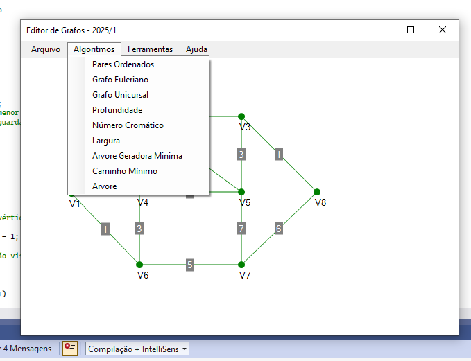

# Projeto Editor de Grafos – README

Este documento descreve o funcionamento, requisitos e uso da classe **Grafo** integrada ao projeto **EditorGrafo**, conforme o enunciado do trabalho.

---

## 📌 Sobre o Projeto

O projeto consiste em integrar algoritmos de Teoria dos Grafos à interface gráfica **EditorGrafo**, fornecida pelo professor. Toda a lógica de manipulação do grafo foi desenvolvida na classe `Grafo.cs`, incluindo métodos de análise, buscas, coloração e cálculo de caminhos.

---

## 📁 Estrutura do Projeto

* **EditorGrafo/** → Interface gráfica fornecida pelo professor
* **Grafo.cs** → Implementação dos algoritmos solicitados
* **Program.cs / MainForm.cs** → Integrações dos menus com os métodos da classe `Grafo`


---


## 🧠 Funcionalidades Implementadas

A classe `Grafo` implementa os seguintes métodos:

### 🔹 `ParesOrdenados(): string`

Retorna todos os pares ordenados das arestas do grafo no formato:

```
(u, v), (x, y), ...
```

### 🔹 `IsEuleriano(): bool`

Verifica se o grafo é **Euleriano**, ou seja, possui um ciclo que passa por todas as arestas exatamente uma vez.
Regras utilizadas:

* O grafo deve ser conexo
* Todos os vértices devem ter grau **par**

### 🔹 `IsUnicursal(): bool`

Retorna verdadeiro se o grafo admite um **caminho euleriano** (unicursal). Regras:

* O grafo deve ser conexo
* Exatamente **0 ou 2** vértices têm grau ímpar

### 🔹 `CompletarGrafo(): void`

Adiciona todas as arestas faltantes entre os vértices, transformando-o em um grafo completo.

### 🔹 `Profundidade(int v): void`

Executa busca em profundidade (**DFS**) a partir do vértice informado.

* Destaca a árvore gerada na interface

### 🔹 `Largura(int v): void`

Executa busca em largura (**BFS**) a partir do vértice escolhido.

* Destaca a árvore gerada

### 🔹 `IsArvore(): bool`

Verifica se o grafo é uma **árvore**, aplicando:

* Deve ser conexo
* Deve ter `n − 1` arestas
* Não pode ter ciclos

### 🔹 `AGM(): int`

Gera e destaca a **árvore geradora mínima** (ex.: usando Kruskal ou Prim).
Retorna o **custo total da AGM**.

### 🔹 `CaminhoMinimo(int vi, int vj): void`

Calcula o caminho de menor custo entre dois vértices (ex.: Dijkstra) e destaca o trajeto.

### 🔹 `NumCromatico(): void`

Realiza a coloração dos vértices com o menor número possível de cores e exibe o **número cromático X(G)**.

---


## 🛠️ Requisitos

* C# (versão compatível com os laboratórios da faculdade)
* Windows Forms (WinForms)
* .NET Framework conforme versão do projeto base

---


## 🧾 Autor

**Lucas Henrique Albergaria**
Faculdade Cotemig
Sistema de Informação / Análise e Desenvolvimento de Sistemas

---
